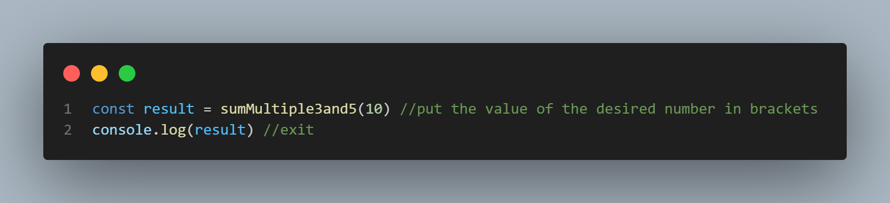

# Project sum of multiples of 3 and 5
This simple JavaScript project calculates the sum of multiples of 3 and 5 up to a given positive integer. The main function, sumMultiple3and5, takes a positive number as an argument and returns the sum of all multiples of 3 or 5 below that number.

## Instructions
Follow these steps to run and test the project:

## Prerequisites
Make sure you have the following installed on your machine:

- Node.js: <a href="https://nodejs.org/en/download/current">Download and install Node.js</a>

## Running the Project

1. Clone the Repository: gh repo clone iagoPinheiro1401/Project-Sum-of-Multiples-of-3-and-5
2. Run the Project: terminal: node index.js

## Testing the Function
To test the function with a different number, modify the value passed to the sumMultiple3and5 function in the index.js file. 

## Example
For instance, to find the sum of multiples of 3 and 5 below 20:

## Note
Ensure that you enter a positive number when calling the function. The function includes a check for this and will display an error message if an invalid input is provided.

## Contributors
- Iago Pinheiro de Oliveira Alves 
Feel free to contribute by opening issues or submitting pull request!
